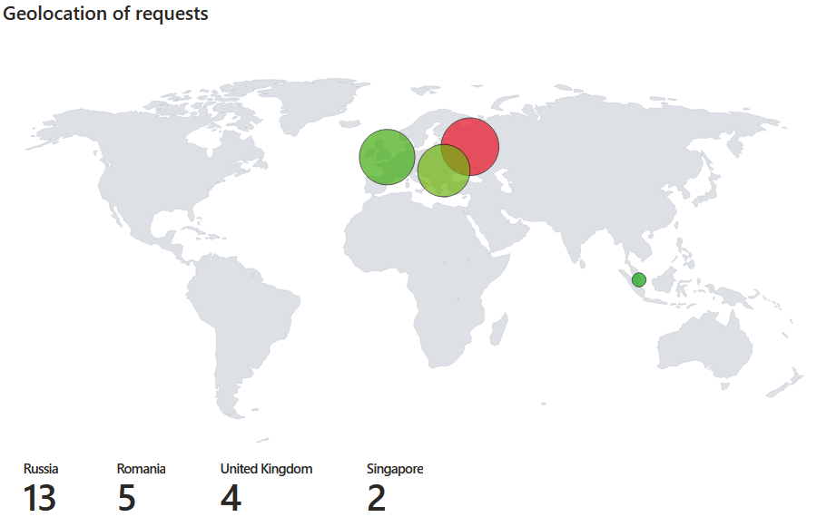
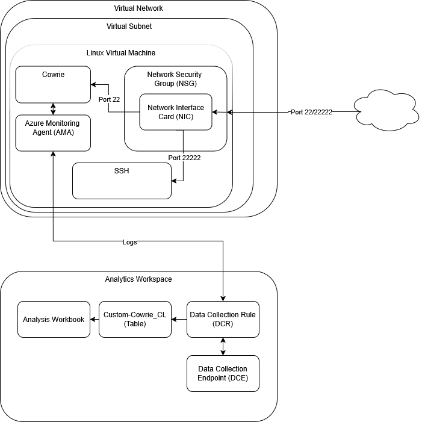

# Azure Cowrie Deployment with Terraform

## 🚀 Key Features

- **Infrastructure-as-Code**: Entirely provisioned via Terraform for repeatable deployments.

- Modern Log Pipeline: Replaced legacy agents with Azure Monitor Agent (AMA) and granular Data Collection Rules (DCR) for JSON log ingestion.

- Advanced KQL Analytics: Custom Kusto queries to parse Cowrie's JSON output into actionable security metrics.

- **Live Threat Mapping**: Integrated Azure Workbook with heatmaps showing global attacker locations.

## Architecture

## 🛠️ Technical Challenges & Solutions

- DCR Schema Validation: Solved "Invalid Payload" errors by strictly aligning stream_declarations with the expected Log Analytics custom table schema and implementing precise KQL transformations.

- Race Condition Management: Handled dpkg frontend lock conflicts between cloud-init and VM Extensions by implementing orchestrated delays (time_sleep) in the Terraform workflow.

## License 
[MIT](LICENSE)